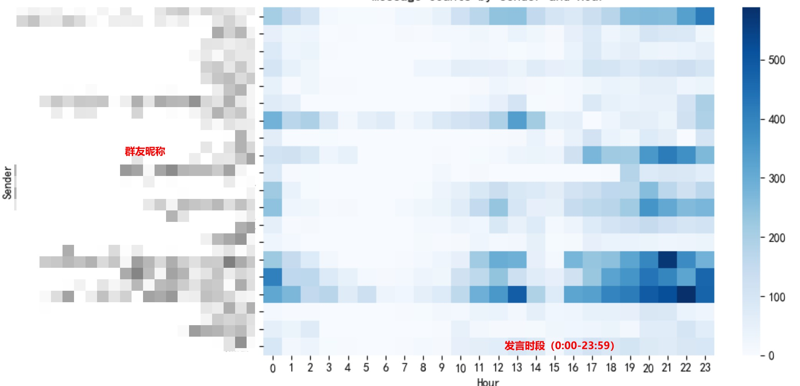
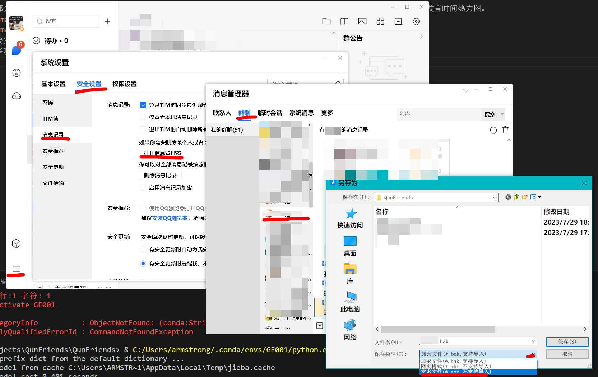

# QunFriends
 Visual analysis tool for QQ group Chat log | QQ群聊天记录可视化分析工具

大部分版本的PC端QQ客户端支持导出聊天记录为txt文件，本项目基于此文件进行分析，为每个用户绘制词云图，并绘制用户的发言时间热力图。

想要实现更理想的效果，需要有针对性地调整词库、停用词词库
更多功能正在构思

##QQ群聊天记录导出方法
设置-安全设置-消息记录-打开消息管理器-找到对应群聊-右键群聊选择导出消息记录-选择txt格式并保存
此处以Tim客户端为示范，QQ客户端大同小异。

##使用方法
请先安装pandas、matplotlib、wordcloud、jieba等第三方库
安装完成后将导出的群聊记录置于项目根目录下，改名为“聊天记录导出.txt”，后运行Scripts文件夹中的toSheet.py以将txt文件转化为规范化的OrganizedData.csv，这个文件以utf-8-sig编码并可以在大多数版本的excsl中直接查看、修改和保存。
随后，运行Scripts\forTimeseries.py和Scripts\forWordcloud.py以生成热力图和词云图。